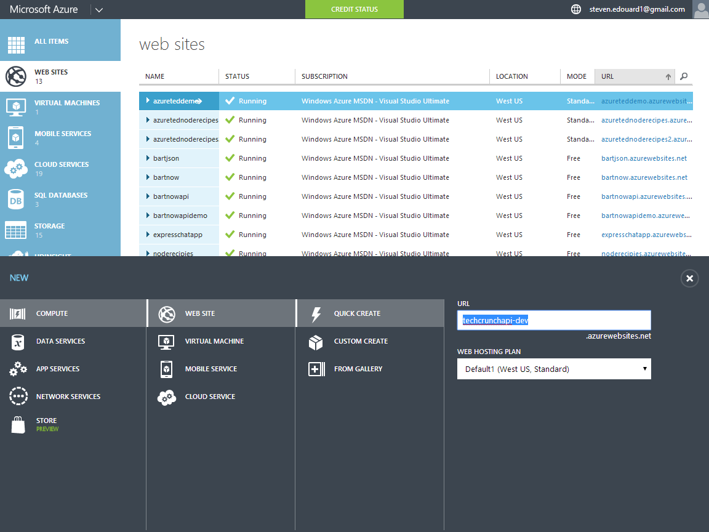

# How to Launch a Rocket from the Cloud with Node.js

-
In this quick lab we will walk through creating a simple Node.js website with a [route]( ) that we can call from our front-end that will launch a rocket! We will build the web service right in our browser.

# Objectives

After this exercise you will learn:

- How to create a route in [Node.js]()
- Calling a route from your front-end
- Making a [REST API]() call to trigger a rocket launch

# Introduction

This lab will use Azure Websites with the Monaco Browser-based IDE. Monaco provides intelligent auto-completion, javascript validation, git integration, and command line to provide you with a fast, all-in-one Node.js website, API and front-end javascript development environment.

**Requirements**

An Azure token provided by @sedouard
A computer with a modern web browser

# Getting Started

To get started first grab your Azure token provided by me, @sedouard. It will look something like this:


After you sign up for your free Azure subscription, you can spin up an Azure Website solution. This is a compute instance which can run most types of web services.

First, go to the current Azure portal (manage.windowsazure.com) not to be confused with the new portal (portal.azure.com). In this portal we will create website by hitting the big '+' on the bottom left side and creating a new website with Quick Create.



In your websites listing, you should see the the new website you just created:


Click on the url and you'll see that you have an empty placeholder waiting for you:


Click on the name of the website and you'll be presented with the site dashboard.  To get to the Monaco Integrated Development Environment (IDE) click on your website name in the list and go to the **Configure** tab:


Afterwards look for a setting called '**Edit in Visual Studio Online**'. This enables the online IDE.


Now, go back to the Dashboard tab and click the link that says '**Edit in Visual Studio Online**':


# The Monaco Editor

When you do the previous step you'll be hurled into a completely new environment - the Monaco Development Environment - which allows you to create full fledged websites and APIs that are hyper scalable right in the browser.

Notice that the IDE looks pretty bare with almost nothing in it besides the default place holder page:


Delete the **hostingstart.html** default placeholder. To get started we'll launch the command line which will give us a familiar command line interface with **npm** and **git**.


Lets create a basic express website with jade as our templating engine and stylus for css. Issue the following commands:

```batch
# install the express template generator
npm install express-generator -g
# create a basic express website with jade and stylus
express --css stylus .
```
Now your file explorer should look like this:


And your app.js should have been generated with a couple routes:


We need to make a REST api call to trigger the rocket. In order to do this, we'll use the **[unirest](http://npmjs.org/unirest)** library. Execute the following command to install it:

```batch
# install the unirest
npm install unirest --save

```

Jump to **[./views/layout.jade](./views/layout.jade)** and these lines of jade which just adds [bootstrap](http://getbootstrap.com) and [jQuery](http://jquery.com).

```jade

doctype html
html
  head
    title= title
    //bootstrap stylesheets and default theme
    link(rel='stylesheet', href='https://maxcdn.bootstrapcdn.com/bootstrap/3.2.0/css/bootstrap.min.css')
    link(rel='stylesheet', href='https://maxcdn.bootstrapcdn.com/bootstrap/3.2.0/css/bootstrap-theme.min.css')
    //jquery
    script(src='//cdnjs.cloudflare.com/ajax/libs/jquery/2.1.1/jquery.js')
    //bootstrap javascript
    script(src='https://maxcdn.bootstrapcdn.com/bootstrap/3.2.0/js/bootstrap.min.js')

  body
    block content

```
**layout.jade**
Now jump to your index view and and lets add a simple form button that will hit a route with a **POST** http message called **fire**

```jade
extends layout

block content
  h1= title
  p Welcome to #{title}
  //a simple form with a submit button
  .form-group
    form(method='post', action='/fire')
        input(type='submit', class='form-control', value='Fire!')

```
**index.jade**

Now in your File Explorer right-click on routs and add new file, **./routes/fire.js** which will we where we implement the **fire** route.


This code is very similar to the other [express routes]() implemented for the [index](./routes/index.js) and [users](./routes/users) routes.

First we'll start by copying the code from the index route:

```js

var express = require('express');
var router = express.Router();

/* GET home page. */
router.get('/', function(req, res) {
  res.render('index', { title: 'Express' });
});

module.exports = router;


```

Now, let's change the title to 'Rocket Fired!', add the unirest library and change the route handler to a POST method instead:


```js

var express = require('express');
var router = express.Router();
var unirest = require('unirest');

/* GET home page. */
router.post('/', function(req, res) {
  res.render('index', { title: 'Rocket Fired!' });
});


module.exports = router;

```

Now that we have our basic route setup, its time to trigger the Rocket to Fire!. To get this done we need to make a **POST** request to the [SPARK.IO](http://spark.io) api, https://api.spark.io/v1/devices/<DEVICE ID>/<METHOD NAME>.

The method name is the method we will execute that is defined on the Spark core device itself. **cycleRelay** is the name of the method we will trigger.

To get more info on how the Spark core is setup check out this [**great github README.**](https://github.com/dxdisrupt/rocket#Title)

```js

  //fire the rocket!
  //TODO: NEVER place your actual spark core access_token in your file
  unirest.post('https://api.spark.io/v1/devices/<SPARK ID>/cycleRelay')
  .send('access_token=<ACCESS_TOKEN>')
  .send('params=r1,1500')
  .end(function(response){
    
    if(response.error){
      console.error(response.error);
      return res.send(500, response.error);
    }
    
    return res.render('index', { title: 'Rocket Fired!' });
  });

```

Putting it all together we have our fully implemented **fire** route

```js

var express = require('express');
var router = express.Router();
var unirest = require('unirest');
/* GET home page. */
router.post('/', function(req, res) {
  
  //fire the rocket!
  //TODO: NEVER place your actual spark core access_token in your file
  unirest.post('https://api.spark.io/v1/devices/53ff6e066667574833512467/cycleRelay')
  .send('access_token=a60207c84d396e58510aae5b91f5bbfb0dccb9a7')
  .send('params=r1,1500')
  .end(function(response){
    
    if(response.error){
      console.error(response.error);
      return res.send(500, response.error);
    }
    
    return res.render('index', { title: 'Rocket Fired!' });
  });
  
  
});

module.exports = router;


```
**./routes/fire.js**

Now all we have to do is hook up the route in [**./routes/app.js**](./routes/app.js)

```js

var express = require('express');
var path = require('path');
var favicon = require('serve-favicon');
var logger = require('morgan');
var cookieParser = require('cookie-parser');
var bodyParser = require('body-parser');
var unirest = require('unirest');
var routes = require('./routes/index');
var users = require('./routes/users');
//load the require route
var fire = require('./routes/fire');
var app = express();

// view engine setup
app.set('views', path.join(__dirname, 'views'));
app.set('view engine', 'jade');

// uncomment after placing your favicon in /public
//app.use(favicon(__dirname + '/public/favicon.ico'));
app.use(logger('dev'));
app.use(bodyParser.json());
app.use(bodyParser.urlencoded({ extended: false }));
app.use(cookieParser());
app.use(require('stylus').middleware(path.join(__dirname, 'public')));
app.use(express.static(path.join(__dirname, 'public')));

app.use('/', routes);
app.use('/users', users);
//include the route on the app
app.use('/fire', fire);

// catch 404 and forward to error handler
app.use(function(req, res, next) {
    var err = new Error('Not Found');
    err.status = 404;
    next(err);
});

// error handlers

// development error handler
// will print stacktrace
if (app.get('env') === 'development') {
    app.use(function(err, req, res, next) {
        res.status(err.status || 500);
        res.render('error', {
            message: err.message,
            error: err
        });
    });
}

// production error handler
// no stacktraces leaked to user
app.use(function(err, req, res, next) {
    res.status(err.status || 500);
    res.render('error', {
        message: err.message,
        error: {}
    });
});


module.exports = app;


```
Now click the **play** buton on the left:


Now when the website loads click the **FIRE** button on the website to fire the rocket!:


